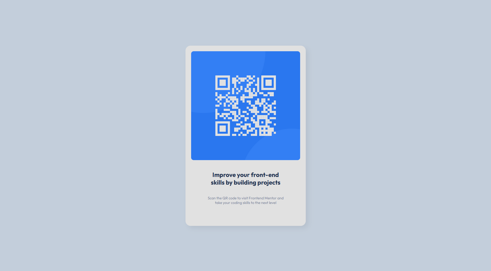

# Frontend Mentor - QR code component solution

This is a solution to the [QR code component challenge on Frontend Mentor](https://www.frontendmentor.io/challenges/qr-code-component-iux_sIO_H). Frontend Mentor challenges help you improve your coding skills by building realistic projects. 

## Table of contents

- [Frontend Mentor - QR code component solution](#frontend-mentor---qr-code-component-solution)
  - [Table of contents](#table-of-contents)
  - [Overview](#overview)
    - [Screenshot](#screenshot)
    - [Links](#links)
  - [My process](#my-process)
    - [Built with](#built-with)
    - [What I learned](#what-i-learned)
    - [Continued development](#continued-development)
    - [Useful resources](#useful-resources)
  - [Author](#author)
  - [Acknowledgments](#acknowledgments)

## Overview

### Screenshot

### Links

- Solution URL: [Add solution URL here](https://your-solution-url.com)
- Live Site URL: [Add live site URL here](https://your-live-site-url.com)

## My process

### Built with

- Semantic HTML5 markup
- CSS custom properties
- Flexbox

### What I learned

This project provided me with an opportunity to revisit the fundamentals of HTML and CSS, with a focus on improving the quality of my code. It also allowed me to explore GitHub Pages for hosting and to begin enhancing my portfolio with simple and quick projects.

To see how you can add code snippets, see below:

### Continued development

In future projects, I am committed to further deepening my understanding of the fundamentals of HTML and CSS. My goal is to achieve a comprehensive grasp of these technologies, ensuring that I can confidently implement best practices and create well-structured, maintainable codebases. By honing my skills in HTML and CSS, I aim to streamline my workflow and avoid unnecessary time spent troubleshooting simple issues.

### Useful resources

- [Flexbox documentation](https://developer.mozilla.org/fr/docs/Web/CSS/CSS_flexible_box_layout/Basic_concepts_of_flexbox) - This helped me to remember every concepts of Flexbox.
- [Box-shadow documentation](https://developer.mozilla.org/fr/docs/Web/CSS/box-shadow) - This helped me to remember how box-shadow was working exactly.

## Author

- Website - [Shad Azuelos](https://www.your-site.com)
- Frontend Mentor - [@shadazls](https://www.frontendmentor.io/profile/shadazls)

## Acknowledgments

This is where you can give a hat tip to anyone who helped you out on this project. Perhaps you worked in a team or got some inspiration from someone else's solution. This is the perfect place to give them some credit.
